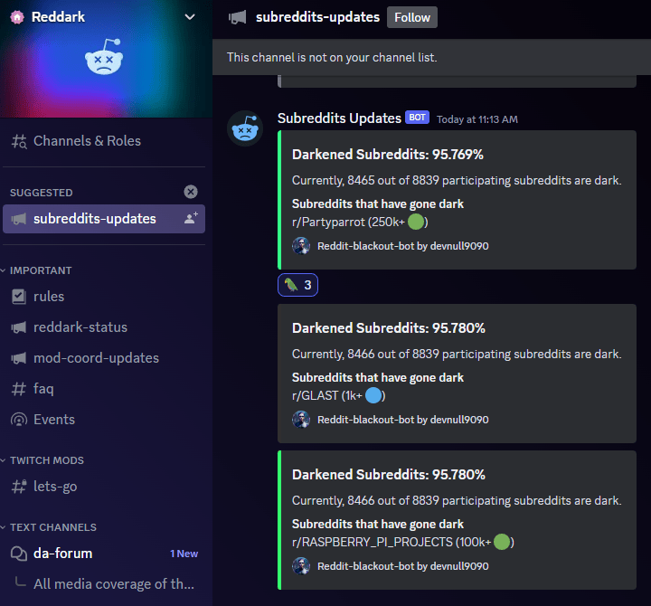
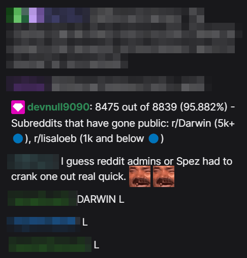

# Reddit-Blackout-Bot

A Twitch / Discord bot and SSE client that tracks subreddits going dark during the [reddit protests of 2023](https://www.reddit.com/r/Save3rdPartyApps/comments/13yh0jf/dont_let_reddit_kill_3rd_party_apps/). This bot listens for chat messages on Twitch streams and provides information about the current status of subreddits. It can also send messages to a Discord webhook.

Also check out https://darktotal.com/ for a real time list of subreddits that have gone dark.




## News / Sponsored Ad

Want to stay up-to-date on Reddit news without spending hours reading through articles? Check out the link below. Tl;dr daily news takes top news articles from around the world and condenses them into easy-to-read summaries. 

- https://tldrdaily.news/tag/reddit

## Features

- SSE client connected to an external SSE server
- Receives subreddit updates and emits events to update the data
- Tracks the number of subreddits that have gone dark or public
- Responds to Twitch chat commands with the status of subreddits
- Sends messages to a Twitch Chat & Discord webhook with subreddit updates

## Requirements

- Node.js
- NPM
- Twitch Account with oauth token

### Optionally

- Discord Webhook

## Dependencies

- `dotenv`: Loads environment variables from a `.env` file
- `tmi.js`: Twitch Messaging Interface for building Twitch chat bots
- `eventsource`: Client for receiving Server-Sent Events (SSE)
- `axios`: HTTP client for sending Discord Webhook messages

## Usage

1. Clone the repository
2. Create a `.env` file in the root directory with the following keys and fill in the appropriate values:

```
TWITCH_USERNAME=<your_twitch_username>
TWITCH_OAUTH_TOKEN=<your_twitch_oauth_token>
TWITCH_CHANNELS=<comma_separated_list_of_twitch_channels_to_monitor>
SSE_URL=<url_of_sse_server>
DISCORD_WEBHOOK=<discord_webhook_url>
```

3. Install the required dependencies: `npm install`
4. Run the bot: `npm start`

## Twitch Chat Commands

- `!dark`: Sends a message with the total number of subreddits that have gone dark, the total number of subreddits, and the percentage.
- `!check <subreddit>`: Checks if a subreddit is dark or not and sends a message with the current status.

Example:
```
!check r/ChatGPT
```

## Discord Webhooks

To enable posting messages to a Discord webhook, set the `DISCORD_WEBHOOK` environment variable in the `.env` file to a valid webhook URL.

## Credits

This bot was built for https://reddark.untone.uk/ to help keep the Twitch stream and Discord chat lively. 

- https://discord.gg/reddark
- https://github.com/Tanza3D/reddark
- https://github.com/reddark-remix/reddark-remix

### Twitch Streams using this bot

- https://www.twitch.tv/reddark_247
- https://www.twitch.tv/moderator/rawreporting

## License

Attribution-NonCommercial 4.0 International (CC BY-NC 4.0)

https://creativecommons.org/licenses/by-nc/4.0/

### You are free to:

- Share — copy and redistribute the material in any medium or format
- Adapt — remix, transform, and build upon the material

The licensor cannot revoke these freedoms as long as you follow the license terms.

### Under the following terms:

- Attribution — You must give appropriate credit, provide a link to the license, and indicate if changes were made. You may do so in any reasonable manner, but not in any way that suggests the licensor endorses you or your use.
- NonCommercial — You may not use the material for commercial purposes.
- No additional restrictions — You may not apply legal terms or technological measures that legally restrict others from doing anything the license permits.
